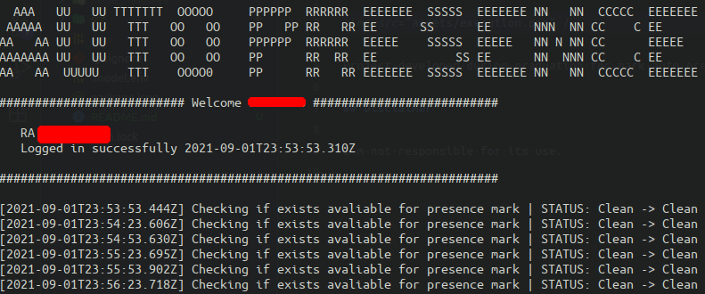

# Auto presence

Project developed during graduation for mark auto presence in the classroom because I often forgot to dial.

## Disclaimer

I'm not responsible for its use.

## Execution example

```
yarn install && yarn start
```


